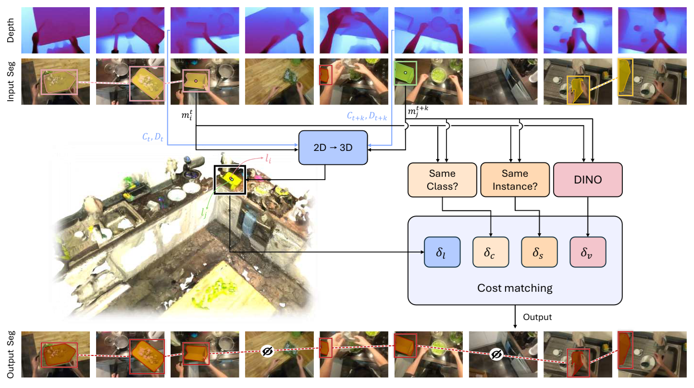

# 3D-Aware Instance Segmentation and Tracking in Egocentric Videos

[Yash Bhalgat](https://yashbhalgat.github.io/)<sup>1*</sup> &nbsp;&nbsp; [Vadim Tschernezki](https://github.com/dichotomies)<sup>1,2*</sup> &nbsp;&nbsp; [Iro Laina](https://eng.ox.ac.uk/people/iro-laina/)<sup>1</sup> &nbsp;&nbsp; [João F. Henriques](https://www.robots.ox.ac.uk/~joao/)<sup>1</sup> &nbsp;&nbsp; [Andrea Vedaldi](https://www.robots.ox.ac.uk/~vedaldi/)<sup>1</sup> &nbsp;&nbsp; [Andrew Zisserman](https://www.robots.ox.ac.uk/~az)<sup>1</sup>

<sup>1</sup> Visual Geometry Group, University of Oxford &nbsp;&nbsp; <sup>2</sup> NAVER LABS Europe

<sup>*</sup> Equal contribution

This repository contains the official implementation of [3D-Aware Instance Segmentation and Tracking in Egocentric Videos](https://arxiv.org/abs/2408.09860).

<p align="center">
  
</p>

Our method leverages 3D awareness for robust instance segmentation and tracking in egocentric videos. The approach maintains consistent object identities through occlusions and out-of-view scenarios by integrating scene geometry with instance-level tracking. The figure above shows: (a) input egocentric video frames, (b) DEVA's 2D tracking which loses object identity after occlusion, and (c) our method maintaining consistent tracking through challenging scenarios.

## Prerequisites

Before running the code, you'll need to install several external dependencies.

We recommend creating a conda/mamba environment, and then installing other dependencies with the provided requirements.txt.

```
mamba create -n egoseg3d python=3.8
mamba activate egoseg3d
mamba install pytorch torchvision torchaudio pytorch-cuda=11.8 -c pytorch -c nvidia
pip install -r requirements.txt
```

Then continue with the installation of following custom dependencies.

1. **Depth Anything**: Required for depth estimation
   ```bash
   git clone https://github.com/LiheYoung/Depth-Anything/tree/1e1c8d373ae6383ef6490a5c2eb5ef29fd085993
   ```
   Copy `scripts/preprocessing/depth_anything_EPIC.py` to the root of the above repository.

2. **Tracking-Anything-with-DEVA** (provided with this repository)

3. **MASA** (provided with this repository)

## Usage
#### NOTE: If you want to skip to the preprocessing, you can jump to [step 5](#5-evaluation).

After downloading the EPIC-FIELDS datasets, few preprocessing steps are required before running the tracking pipeline.

First, extract the 3D mesh from the sparse point cloud:
```bash 
bash scripts_sh/reconstruct_mesh.sh <VID_1> <VID_2> <VID_3> ...
```

Generate depth maps using Depth Anything:
```bash
cd Depth-Anything
python depth_anything_EPIC.py --img-path <images dir> --outdir <output dir>
```

Extract and align depth maps:
```bash
# Extract mesh depth
python scripts/preprocessing/extract_mesh_depth.py --vid=$VID --root $ROOT

# Align depth maps
python scripts/preprocessing/extract_aligned_depth.py --vid=$VID --root $ROOT
```

### 2. Instance Segmentation and Feature Extraction

Run DEVA for segmentation:
```bash
SFACTOR=5
PID=$(echo $VID | cut -d'_' -f1)
python scripts/deva_baseline.py \
    --img_path $ROOT/mesh/$VID/images \
    --output $ROOT/$PID/$VID/segmaps/deva_OWLv2_s$SFACTOR \
    --amp --temporal_setting semionline --prompt "" \
    --DINO_THRESHOLD 0.4 --detector_type owlv2 \
    --subsample_factor=$SFACTOR --classes=$ROOT/visor/$VID\_classes.pt
```

Extract DINO features:
```bash
python scripts/extract_features_DEVA.py \
    --deva_seg_dir $ROOT/$PID/$VID/segmaps/deva_OWLv2_s$SFACTOR \
    --images_dir $ROOT/mesh/$VID/images \
    --output_dir <output directory> \
    --feature_type dinov2
```

### 3. VISOR Annotation Extension

Extend VISOR annotations using DEVA:
```bash
python scripts/deva_groundtruth.py \
    --img_path /datasets/EPIC-KITCHENS/$VID/ \
    --output /datasets/EPIC-KITCHENS/$VID/visor_DEVA100_segmaps/ \
    --amp --temporal_setting online \
    --gt_dir $ROOT/$PID/$VID/visor_segmaps/ \
    --max_missed_detection_count 100 \
    --prompt "dummy1.dummy2"

python scripts/preprocessing/postprocess_deva_gt.py --vid $VID
```

### 4. 3D-Aware Tracking

Run the main tracking pipeline:
```bash
python extract_tracks.py \
    --beta_l=${BETAL} --beta_c=${BETAC} \
    --beta_v=${BETAV} --beta_s=${BETAS} \
    --vid=${VID} \
    --exp=tracked-final-bv${BETAV}-bs${BETAS}-bc${BETAC}-bl${BETAL}
```

### 5. Evaluation
To verify the reproducibility of the results, we provide the tracking predictions [here](https://drive.google.com/file/d/1f5fQy_yqAdSaVNRnHLyX10c9t6u9RkLz/view?usp=sharing). You can download the predictions and evaluate them using the following script.

Evaluate OUR results:
```bash
# we provide predictions for following hyperparameters and video
BETAV=2
BETAS=10
BETAC=10000
BETAL=10
VID=P01_104

python scripts/eval_deva.py \
    --segment_type=tracked-final-bv${BETAV}-bs${BETAS}-bc${BETAC}-bl${BETAL} \
    --gt_type=visor_DEVA100_segmaps \
    --vid=${VID}
```

To evaluate the DEVA baseline, replace the `segment_type` with `deva_OWLv2_s5`.


## Citation

If you find this work useful, please cite:
```bibtex
@InProceedings{Bhalgat24b,
  author       = "Yash Bhalgat and Vadim Tschernezki and Iro Laina and Joao F. Henriques and Andrea Vedaldi and Andrew Zisserman",
  title        = "3D-Aware Instance Segmentation and Tracking in Egocentric Videos",
  booktitle    = "Asian Conference on Computer Vision",
  year         = "2024",
  organization = "IEEE",
}
```

## Acknowledgments 

This work was funded by EPSRC AIMS CDT EP/S024050/1 and AWS (Y. Bhalgat), NAVER LABS Europe (V. Tschernezki), ERC-CoG UNION 101001212 (A. Vedaldi and I. Laina), EPSRC VisualAI EP/T028572/1 (I. Laina, A. Vedaldi and A. Zisserman), and Royal Academy of Engineering RF\201819\18\163 (J. Henriques).
